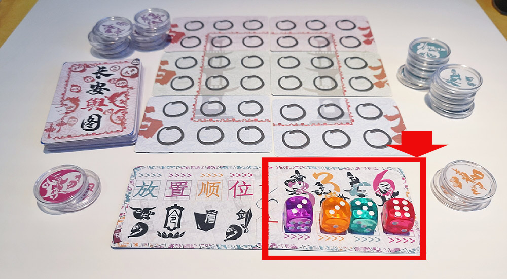
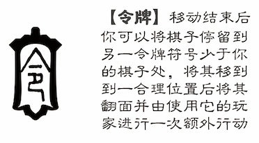

# 长安不良录视频图文教学

 当前版本 `v 0.0.1` 

# [教学1: 游戏准备](1)

## 视频演示


### 1.棋子制作

拿到盒装游戏的小伙伴需要先把棋子牌裁切成小圆片放到棋子盒里，拿到散装游戏的玩家可以将小圆片贴在5角硬币，为了保证游戏体验使得棋子能够正常翻面，建议使用两幅以上的牌制作棋子。

**详细的棋子制作教程请点击以下带有图片链接符号🔗的图片[阅读公号文章](https://mp.weixin.qq.com/s/y3oFaqFZSmBkWjBUHeEA5w)。**

[](https://mp.weixin.qq.com/s/y3oFaqFZSmBkWjBUHeEA5w)

#### 内含棋子的卡牌外观 👆

[](https://mp.weixin.qq.com/s/y3oFaqFZSmBkWjBUHeEA5w)

#### 棋子分类 👆

- (**1) 普通舆图牌，用于组成游戏【戒严牌堆】

- (**2) 无地点的舆图牌，牌背有“初”字标记，主要用于教学演示和后续扩展，共六张。

- (**3) 计分牌 及 备用计分牌

- (**4) 需要用到的棋子牌(橙、紫、桃红各一张、碧绿两张、碧绿+紫色混合一张)

- (**5) 备牌

[](https://mp.weixin.qq.com/s/y3oFaqFZSmBkWjBUHeEA5w)

#### 裁切过程 👆

[](https://mp.weixin.qq.com/s/y3oFaqFZSmBkWjBUHeEA5w)

#### 棋子成品 👆

### 2.计分牌制作

[](https://mp.weixin.qq.com/s/y3oFaqFZSmBkWjBUHeEA5w)

#### 打孔 👆

[](https://mp.weixin.qq.com/s/y3oFaqFZSmBkWjBUHeEA5w)

#### 斜三角和套接 👆

## 总结

- 根据玩家人数选择阵营
- 根据阵营选择不同数量的起始棋子
- 摆放计分区骰子
- 构造初始地图
- 进入【**放置阶段**】、【**行动阶段**】和【**戒严结算**】的玩家回合。

# [教学2: 放置阶段](2)

## 视频演示


### 放置顺位

- 1) 不良人
- 2) 官员
- 3) 官兵
- 4) 刺客

#### 1.不良人

- 第一回合摆满【地图外围】【暗桩】符号，其他回合可选(符号见图👇)

- 可以【正面放置】，也可以【反面放置】


#### 2.官员

- 只能【正面放置】

- 摆满【地图外围】【官府】符号 (符号见图👇)

- 每一回合都需要填满地图外围官府符号，直到棋子用尽


#### 3.官兵

- 每回合最多放置**两枚**棋子

- 只能【正面放置】 摆在【地图内围】【兵营】符号(符号见图👇)


#### 4.刺客

- 一回合只能放入**一枚**棋子到【贼窝】符号处(符号见图👇)
- 只能【反面放置】


### 行动力加成

>  行动力 `等于` 棋子上的符号个数。(莲花符号除外)

- 【寺庙】符号给刺客+1行动力

- 【市场】符号给官兵+1行动力

- 【暗桩】符号给不良人+1行动力

# [教学3: 官员行动](3)

## 视频演示


### 行动顺位

根据初始设定依照行动顺位牌面顺序行动，依次为`官员` > `官兵` > `不良人` > `刺客`


> 官员最先；刺客最后
> 




###  官员调任

> 移到官府符号翻面即可得1分；不可返回原点

### 官员技能【令牌】



```php
小贴士:
//令牌技能是全场唯一一个可以挤走别人位置的技能
//负面效果是给该棋子的执子玩家一次额外的回合
//一般用于自身联动和与联盟阵营的联动(比如官兵)
//自身棋子的联动可以突破行动力限制
```

