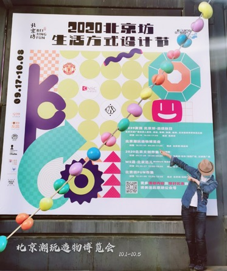

# 生活方式设计节

### 今日上新

### 志愿之星

### 劝业坊和设计节

相信大家来逛展拍了很多美美的照片

午后的阳光穿过穹顶的琉璃，洒满玩具展的各个角落，它们跟手工匠人们的玩具玩耍，把设计与生活融合在了一起，这成就了 5 天设计节中的精彩，也成就了我们这次成功的活动和照片墙上 100 多张幸福的脸庞。

也因为这次成功的互动，笔者决定为 果酱V视 添加【活动墙】功能，继承【桌范儿】线下桌游活动的衣钵，利用app快速发布的能力，有组织地将过往线下活动的精彩照片和视频、志愿者风采定格在这一片自留地，在这个越发浮躁和注意力分化的社会，让每个曾在格子间中为生活挣扎的我们，找到一丝情感共鸣。

>  接下来 果酱V视 会进入功能和界面的高速迭代，并将更多新功能和教学呈现给大家，还望大家使用身边的安卓设备安装应用，多多反馈建议，感谢大家支持！

# 有话要说

做为展商，笔者在展会上发现一个几乎共通的用户行为——快速点掉开屏页面。

可以说这是移动互联网行业发展许久以来劣币驱逐良币的必然结果——抢占用户注意力，可是 `果酱V视` 主张 `有用` ，并不会推送广告。

因为果酱V视 始终鼓励玩家从内容消费端转向内容生产端，借用移动设备快速记录信息的能力，形成个人经验的积累以全互动教学视频的方式呈现，并最终形成有偿分享的良性循环，论语说：`三人行必有我师焉`，而我想说：`若为师，必先利其器`。

#### 内容生产者体验

每个人都在生活实践中学习，也都在成为良师的道路上精进，然而之所以别人可以以课程的形式出售，而你却只能随笔，终其原因是缺乏形成体系化的工具，移动视频化的时代，精力有限的我们每个人未必需要一个3-50人的团队来运作。

> 视频能播就能录，何必导入导出？想引用一段文档，要么找不到，要么需要格式转化，用一下而已还要收费，还收年费；其实我只是想分享我熟悉的领域知识，何必必须先成为XX专家，或者先买一个毫不相干的全家桶？

互联网大厂会几十万成本地堆人去优化娱乐向页面让你“买买买”！可谁关注那些忍受复杂的流程、漫长的等待和自顾自家的专有格式的可怜的内容生产者的体验呢。

### 关于连载

订阅和连载是一脉相承的功能，好像前者专门针对线上，后者针对线下，其实优质内容都是聚沙成塔堆积而成的，在企业中我们有内部机制去监督调优，而当我们成为个体时就缺少了这种现成的`目标反馈机制`，那么同主题的连续推送就如同系列漫画的连载创作一样。

就像笔者开发完应用并没有结束，而是要马不停蹄地编写教程教大家如何使用，工具得当则顺水推舟，可是...

越是强大的软件越需要`循序渐进`的科学教育，否则就成了`空中楼阁`，而这个过程当中最消耗人意志的就是与内容物无关的各种`系统问题`、`平台问题`，小伙伴辛辛苦苦编写的后台活动文案因为技术问题瞬间化为乌有，这种事屡见不鲜。

### 超级个体时代

未来十年是经济下行之年，但是科技并未退缩，这会导致超级个体的崛起，传统 B 端业务向 C 端蔓延，互联网本身就是一个巨大的数据池，连接每一个超级个体。我们已经能够感受到身边的小伙伴开始在微信视频号上录课进行自我贩卖，那么，除了鸡汤？科普？有没有能够真正系统化训练的课程呢？敬请关注正在崛起的新秀 果酱V视，使用它，鼓励它，提供行业样本成为行业范例，实现工作app的私人定制。

# 作者简介

闫佳奇 达佳芬奇科技工作室技术总监，欢迎访问我的[知乎主页](https://www.zhihu.com/people/digitalspritejack)。

从事移动互联网开发8年，历经 [乐知行软件 (现讯飞乐知行)](https://baike.baidu.com/item/%E5%8C%97%E4%BA%AC%E4%B9%90%E7%9F%A5%E8%A1%8C%E8%BD%AF%E4%BB%B6%E6%9C%89%E9%99%90%E5%85%AC%E5%8F%B8) 、[百度移动游戏](https://baike.baidu.com/item/%E7%99%BE%E5%BA%A6%E7%A7%BB%E5%8A%A8%E6%B8%B8%E6%88%8F)、[白鹭时代](https://baike.baidu.com/item/%E5%8C%97%E4%BA%AC%E7%99%BD%E9%B9%AD%E6%97%B6%E4%BB%A3%E4%BF%A1%E6%81%AF%E6%8A%80%E6%9C%AF%E6%9C%89%E9%99%90%E5%85%AC%E5%8F%B8)、[阿里云](https://baike.baidu.com/item/%E9%98%BF%E9%87%8C%E4%BA%91)，对教育工具、游戏引擎，游戏渠道、云计算有较强的技术产品整合能力。

热爱游戏设计，2019年以热播剧《长安十二时辰》为原型，独立设计出版了桌面游戏《长安不良录》，随后开发续作《长安不良录2》、以电影《致命ID》为原型设计《身格疑云》系列，同期立项C-licke电游《九宫格CS》

