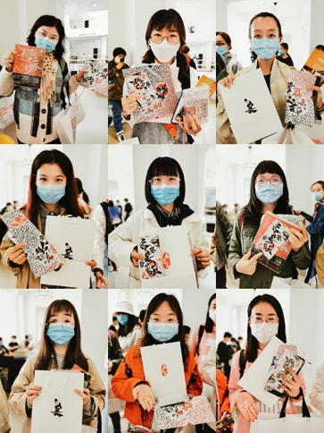
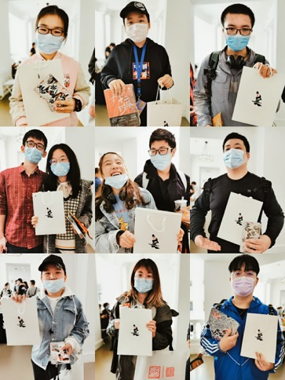

# 照片墙故事

### 今日上新

### 志愿之星

本日志愿者有一个特殊身份，她是1日照片墙中的一员，得知4日志愿者空缺愿意尝试流程讲解

### 【文章】概念详解

上节课我们学习了文本【基本操作】和【引用】

第二节课我们也用视频来学习一下【参数】【循环分割】【删除和锁定】和【传送门】

> 循环分割：可以将文本或引用按【段】【行】和【标点符号】进行切分并返回一个【引用】

【引用】为字幕工具主要使用，且是 `果酱V视` 的基本数据单元。

#### 【视频教学】

