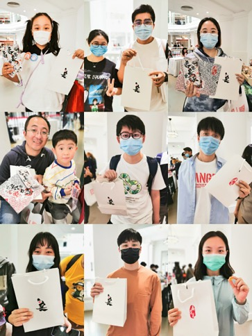
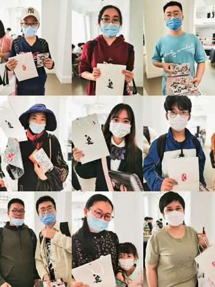
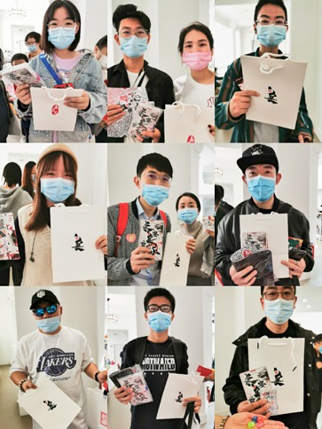
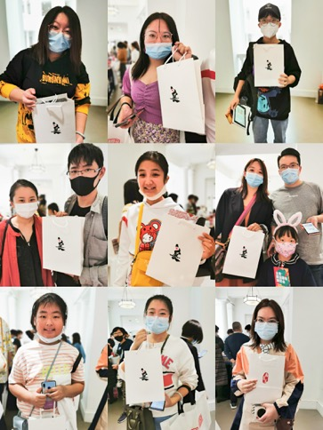
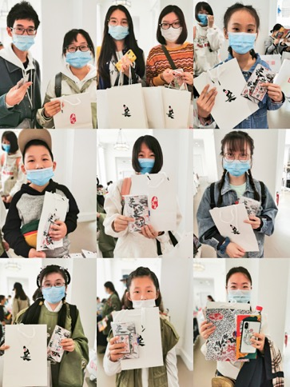
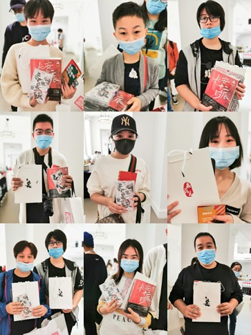
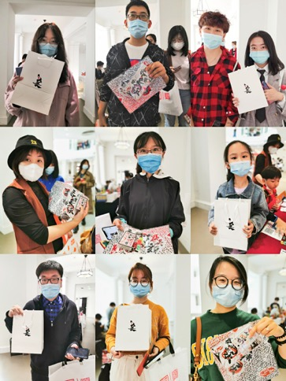
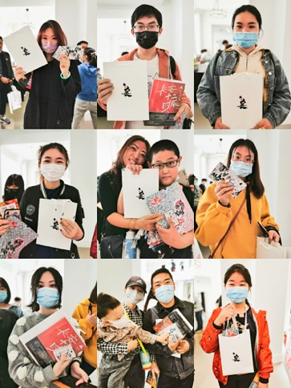
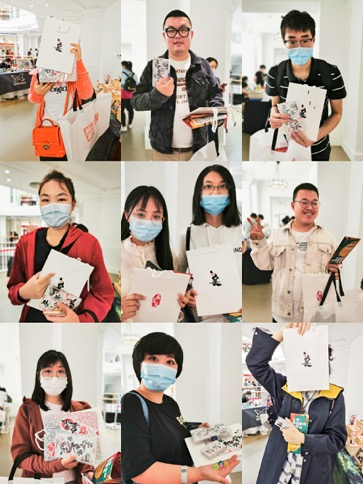

# 从照片墙到效率墙

### 今日上新，排名不分先后

### 【文章】你关注效率么？

笔者又开始写作了，从今天开始一点一滴推送软件教程，这也是我最兴奋的地方。

在地铁上制作照片墙的时候我就在想，为这么热爱华为机，以及为什么这么爱用美图秀秀，因为它们真的在 **效率** 方面优秀，相比于photoshop的臃肿繁杂，美图把图片操作变成点击滤镜查看效果，`对比-筛选-出片` 就是这么简单；相比于其他手机的后期，华为通过机内算法调节出色彩浓郁的可直接应用的后期片，甚至计算出背景模糊效果，省去了很多再调整的步骤，毕竟可以节约时间就是追求效率本身。

【果酱V视】是从效率本身出发推倒重做的应用，它基于

[Flutter 框架](https://flutterchina.club)修改了大部分软件 _创建文本_ 和 _编辑文本_ 的底层逻辑并最大化避免手机上的【编辑灾难】，目前应用看起来简单原始是因为它更像是一个架构，底栏成为操作中心，中间是舞台承载应用场景（视频制作、游戏制作、文章和解谜书等），果酱V视将成为移动端的[VSCode]()

> 编辑灾难：手机上编辑文本必须顺畅，一旦出错，点选，框选，长按，移动，都无法精准定位，以及更加容易误触“全选”和“删除”这两个编辑杀手，这些功能归根结底是从PC端移植来的思想，觉得编辑文本就得有这两样，并且跟复制和粘贴设计在一起。

果酱V视 从本期开始给大家普及一些【程序员】们常用的工具，并利用 `微信`传输、`美图`处理、`typora`	编写文章和预览、`本地文件系统`做为仓库、`git客户端`做为发布工具形成教程系列，那么就先视频介绍一下我们的拳头功能，大家可以看一下视频中我[开始录制的时间]

> 效率墙：一面能够提高效率的软件组合墙，让你逐渐能够像我一样在地铁里把大部分工作做完，这些工作可能是素材筛选类的，批处理类的，导入导出类的，创意编辑类的，当完成这些工作之后我们再回到电脑前整理成产品形态(强调格式)

#### 认识文字编辑工具【视频教学】

