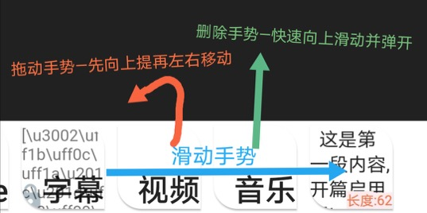
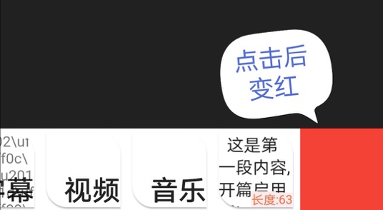
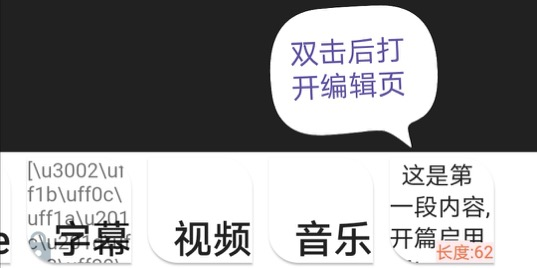
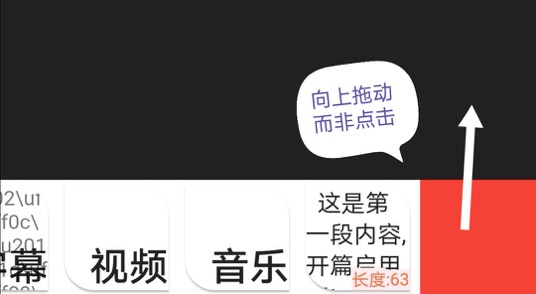
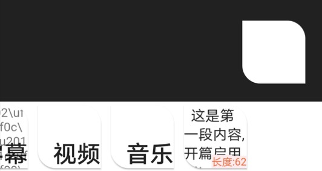
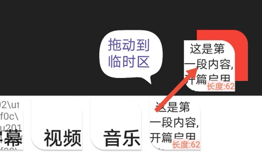
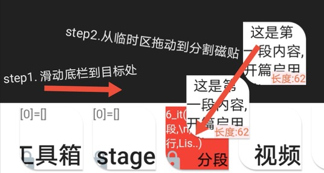
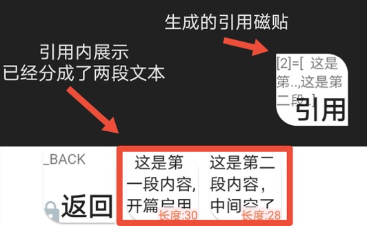

# 1.基础篇

## [初识文字编辑工具【含视频教学】](1)

### 【基本操作】

文字操作使用磁贴工具，基本的**操作手势**有三种

- 滑动
- 拖动
- 删除

**点击底栏空白区域新增文本**

**双击文本进行编辑，编辑后后退会默认保存**

> 【磁贴】对底栏方块状的操作单元的称呼，类似winphone中的“动态磁贴”
> 【临时区】低栏右上角，屏幕右下角一块隐藏区域，类似砧板，可以往上叠加磁贴，用于整理和方便跨引用拖动操作，也是生成新的磁贴的存放区。

### 超视距拖动示意图

> 将文本【磁贴】拖动到可以点击切换状态的【分割】磁贴可以在【临时区】生成分割后的【引用】

### 【引用】

可以盛放多个磁贴的容器，点击引用磁帖查看容器内容，点击【返回】回到上一个容器层级，底栏本质上是引用容器的展示区。引用是果酱V视最基本的`可视化数据操作单元`。

### 【视频教学】

## [高级概念【含视频教学】](2)

### 概念详解

上节课我们学习了文本【基本操作】和【引用】

第二节课我们也用视频来学习一下【参数】【循环分割】【锁定和解锁】和【传送门】

### 参数

盛放物为【key: value】类型的磁贴数据，一般用于更改外观和行为。 

### 循环分割

> 循环分割：可以将分割后生成的引用继续按【段】【行】和【标点符号】进行切分并返回一个新的【引用】

### 锁定和解锁

拖动到自身上可以锁定以及解除锁定

> 锁定后无法被删除和编辑。

### 传送门

被拖动于其上的磁贴被移动到上一个层级的引用中，锁定状态下只会传送一个【镜像】

> 镜像 不是复制，只是一个影子而不是实体，对其操作将同步更改本体。

#### 【视频教学】

