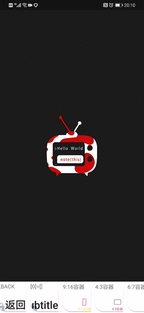
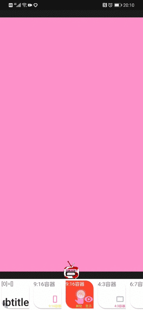
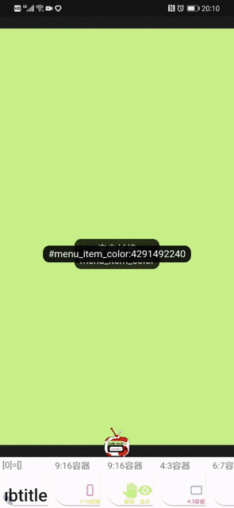
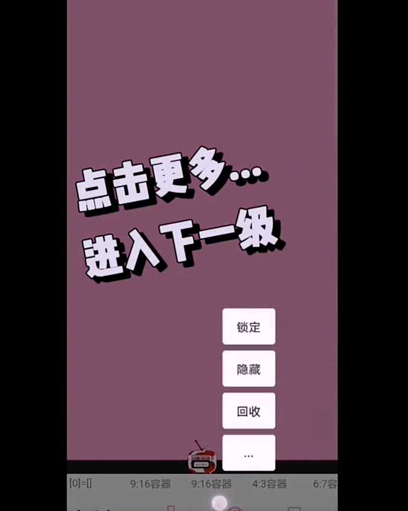

# 【学习】使用菜单命令

## 【长按】磁性贴将进入菜单选项

直接点击选项完成对应操作，成功后会有 `浮层提示`。

 菜单选项支持多级操作 点击 `...` 进入`下一级` 

## 【长按选项】触发菜单联想

长按菜单项将触发 `菜单联想`，可以打开 **教学文章** 或者触发 **推荐选项**

- 教学文章：引导用户学习如何使用该菜单项
- 推荐选项：通过用户偏好的收集完成智能专家推荐

> 菜单联想将根据当前用户所处的选项 结合过往选择所收集到的用户偏好，提供逐渐细化的选项推荐

## 【视频/案例】更换画布颜色

完整演示如何利用菜单项完成  `复制` -> `锁定` -> `解锁` -> `更换颜色` -> `回收`

