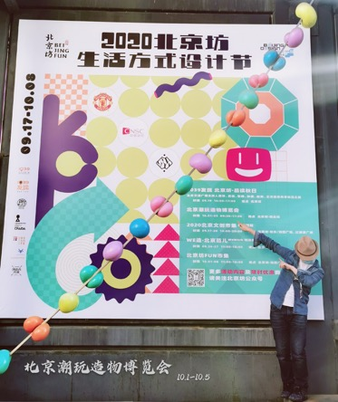
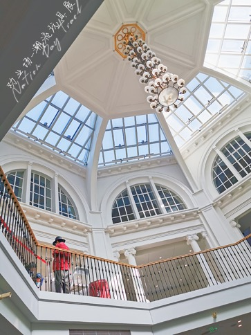
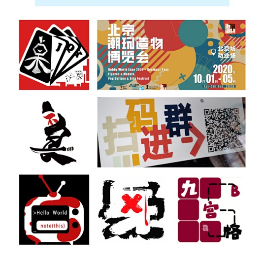
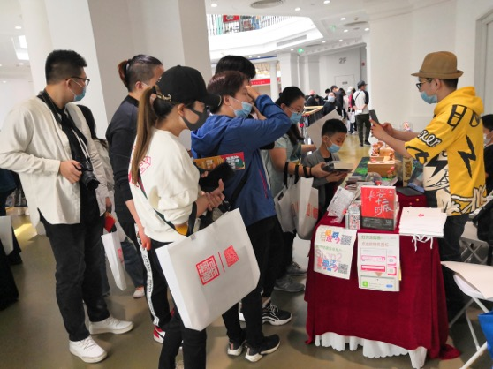
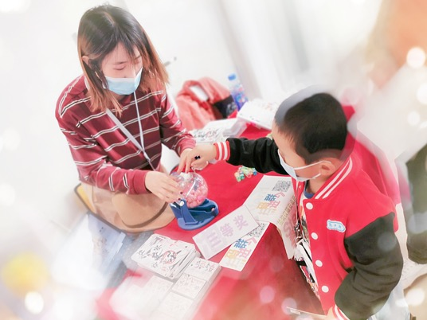
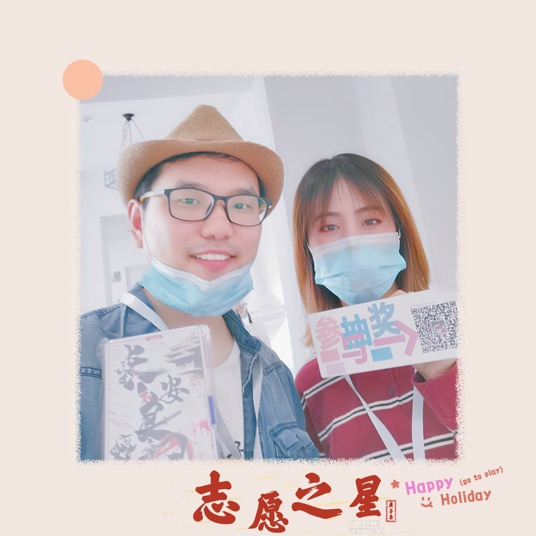
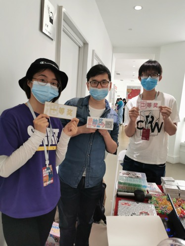

# 果酱V视实战教学

### alpha2 版本实战

下载果酱V视观看此篇文章，以下图片自动播放【视频】

### [活动回顾](1)
过去的这个十一对笔者来说真的是足够忙碌，因为这是笔者从五月份决定制作app以来第一次成果亮相。
展会位置坐落于前门大栅栏的北京坊劝业场，展会全称“北京潮玩玩具创意展”，隶属于十一期间的北京坊生活创意节展览之一。

此次活动笔者以正在申请中的`达佳芬奇科技工作室` 身份参展览，成功利用过往设计的桌游作品跟app进行了抽奖联动。活动现场持续火爆：

更以极低概率`(三个一等奖兑换)` 送出了我们的大奖台湾原创桌游：

活动的成功举办更要感谢 **志愿者** 和到访朋友的鼎力相助。

凭借 **果酱V视** 强悍的内容发布和推送能力，展会五天每天都能及时地推送笑脸墙上那一张张领取到奖品后开心的笑脸😊，十一假期分享给自己的亲朋更是开心的事。

并直至展会结束，软件更新共计完成 3 次推送，可谓证实了其 `效率至上` 的理念。
下面就让我们来看看精彩推送集锦

最后对软件感兴趣的小伙伴欢迎点击开头的实战教学，下载试用 app并帮助我们改进版本体验哦！

若失效请到 app 中频道页面查看最新二维码。

