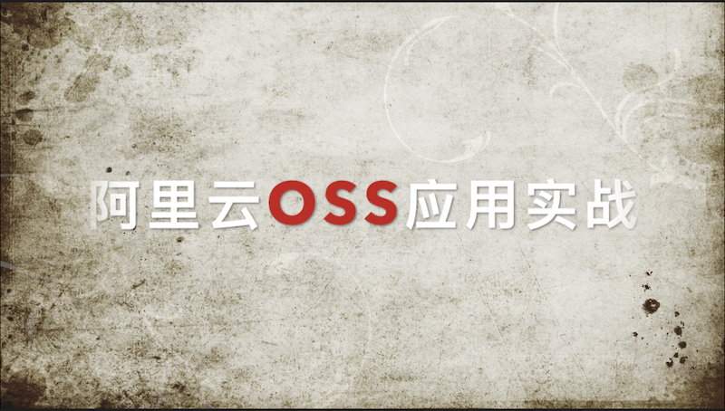

# 【科普】阿里云OSS应用实战

## 什么是OSS

高可靠对象存储云服务

## 如何注册并开通OSS

- 使用淘宝账号登陆[阿里云官网](https://www.aliyun.com)
- 进入`首页` -> `产品分类` -> `云计算基础` -> `存储服务` -> `对象存储OSS` -> `折扣套餐` 
- 进入到购买页面 -> 以自己需要的配置购买套餐
- 进入`管理控制台` 开始使用

## 如何使用OSS

- `登陆账号` -> `右侧产品与服务`-> `对象存储OSS控制台`
- `Bucket列表`-> `创建Bucket` -> `文件管理` -> `上传文件` -> `详情` -> `复制链接` -> `在应用中使用链接`

## 为什么要使用OSS

对比传统服务器自己搭建存储服务有如下优势：

- 省事儿
- 省心
- 省钱

对比云盘有如下优势：

- 面向应用
- 面向接口
- 可以外链

## 什么是云服务

把传统需要为每个厂商、企业单独进行服务器搭建、配置和维护，变成统一集中管理，能够像淘宝橱窗一样细粒度地【按需分配】服务器资源。

## 展望: B端 or C端

- 【背景】：技术架构/产品 -> B端 ->上限 -> 为B端服务 -> 巨头B端 ->为C端提供服务

- 【矛盾】：C端价值 每一个人本身大多数都在B端(公司企业里)上班 体现我们的价值 / 占据我们的时间

- 【抓手】：工具 -> 提升效率 -> C端打造成超级个体

- 【趋势】：C端 + 超级工具(B端 企业内部应用CMS 绩效管理)

- 【优势】：云服务 ->一个个服务器 + 技术人员 -> 拆散成一个像淘宝一样 一个个的橱窗/ 我用了多少你的产品，你为我提供了多少价值，我需要为此付费多少 ->按需分配

- 【前瞻】：超级个体(C端个例) 既是生产者也是消费者，互联网基础流量（自带流量） 

我们这里已经有一款软件 能够赋能具有超级个体潜质的C端用户

## 推广信息

果酱V视 app下载

