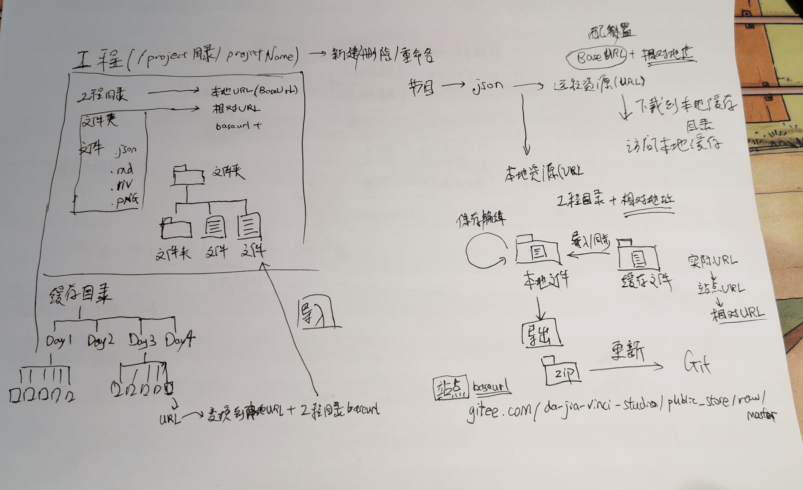
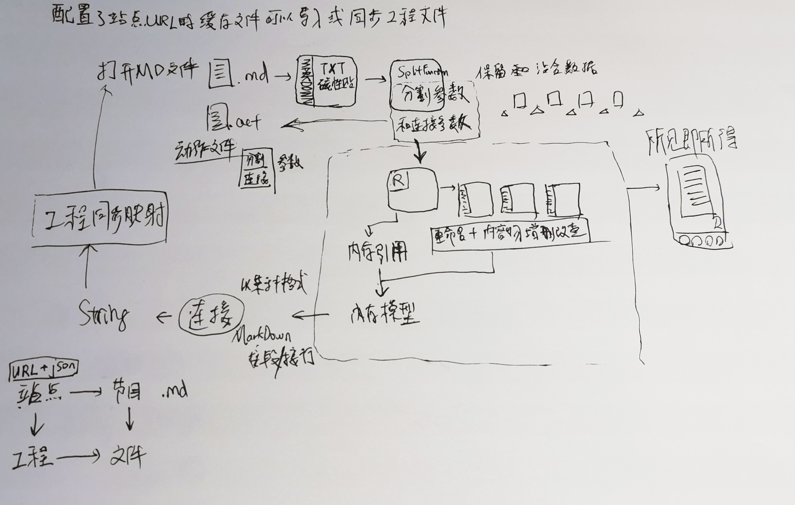

# TODO LIST（20日-23日）

> 果酱V视播口袋书，是手机端以互动节目为呈现手段的去中心化开放知识库，分为个人版和企业版
> 节目涵盖互动图文、互动视频、卡牌游戏、演示教学。

- 批量删除
- 文字设置背景图 (目前有困难)
- 菜单调试模式
  - markdown 显示 - 基于 label 字段进行 markdown 语法编辑
  - raw json显示 - 基于文本编辑
  - 引用显示 - 基于磁贴编辑
- 本地缓存编辑模式 - 添加 `本地资源管理`
  - 可以删除缓存文件
  - 可以编辑缓存文件(即时生效)
  - 可以使用离线模式
    - 可以生成 `本地工程` [^1] (命名区间与本地缓存不同)并同步缓存文件
      - 一旦成为工程，相同请求的工程文件和缓存文件进行单独管理。
      - 两者只能通过 `同步功能` [^1] 从缓存文件向工程文件进行同步
      - 从工程文件向缓存文件没有同步的概念，但是可以将工程文件以工程文件 `.zip` 包的形式导出，后覆盖对应的Git工程提交后达成。
  - 支持 `工程引用磁贴` [^2]，与本地工程目录文件相映射的即时保存机制
- 快速复制节目源码到磁贴
- 从 `设置` 配置节目源 ——站点

## 如何演示：

1 如何编写自己的节目

- 前情介绍
	- 熟悉 markdown 语法
	- 熟悉 json 格式语法
	- 熟悉 Git 版本控制工具

- 需要准备的工具 / 账号
	- Markdown文本编辑器 推荐 Typora
	- 可视化 Git 仓库管理工具 SourceTree
	- 远程 Git 仓库配置 推荐 Gitee 码云 / 或 Github

- 工作流程
	- Typora上编写节目或剧情 / 设置谜题(alpha4版)
	- 将节目配置到 json 格式的入口文件 / 谜题交互(节目路由)
	- 使用 SourceTree 等 Git 客户端工具上传所有节目资源和入口文件
	- 将入口文件地址配置到果酱V视 (设置 -工程 -添加站点)
- 点击新创建的站点工程 -查看节目单 -点击节目单中的目录或节目查看节目效果

2 如何调试自己的节目

- 从 设置 -工程 -新添加的站点右下角 导入>> 进入缓存管理界面，多项选择可导入的节目文件，选择导入后站点点击进入站点管理界面，分为
  - 节目单置顶
  - 演示
  - 导入
  - 导出
- 从 设置 -调试 打开调试模式，返回工程站点进行演示操作，此时可以选择调试使用的显示模式
  - 节目的页面部分可以采用 `markdown`、 `网页模式` 和`原始模式`，可以长按模式按钮跳转到当前引用磁贴进行实时编辑。
  - 节目的菜单部分可以采用`markdown`、`原始选项`和`原始模式`，长按模式按钮跳转到菜单引用磁贴进行实时编辑。

并调试，进行站点功能（微信群）。

alpha4版本将进行节目推送，节目发布，站点收藏和推送，完整的互动小说制作流程。

如何制作并插入动画文件？
（alpha4）如何为视频制作交互界面并影响后续播放流程。

[^1]: 缓存文件与本地工程

[^2]: 本地文件保存与内存磁贴的同步机制

